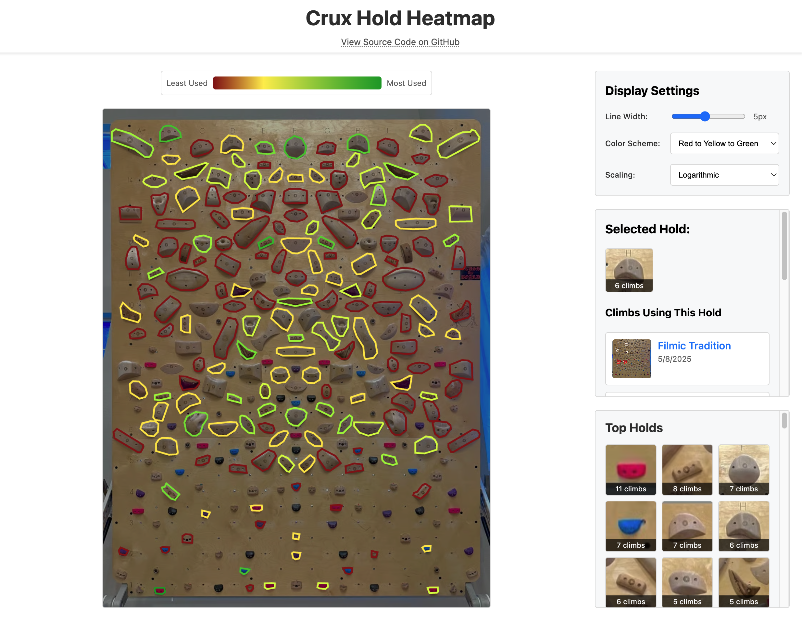

# Climbing Hold Heatmap

Visualize the frequency that holds are used on a Crux climbing wall. This is a quick integration with the public Crux API.

The heatmap is deployed here: [https://d12.github.io/crux-hold-heatmap/](https://d12.github.io/crux-hold-heatmap/)

## Gallery

### AnglePhile Wall

### The A

